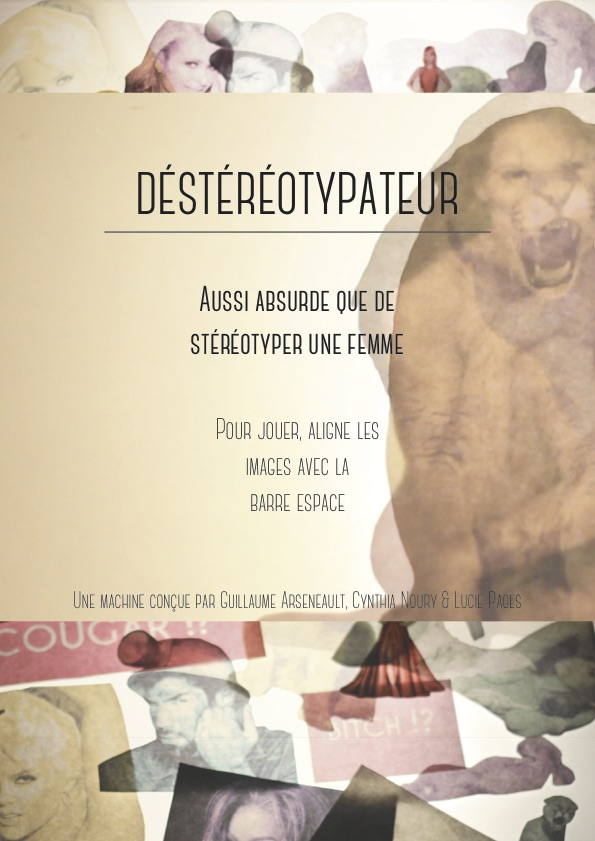
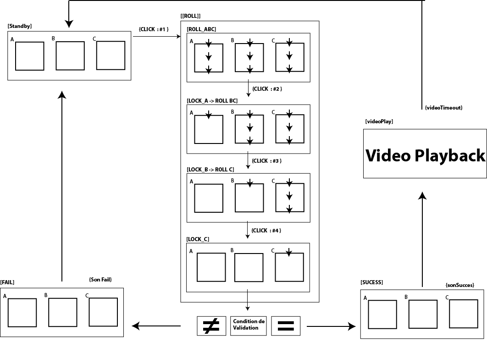

#Déstéréotypateur

 

### Concept

Reproduire un système de loterie vidéo qui critique les stéréotypes imposés au genre féminin.  

### Fonctionnement 

Fonctionne sous le paradigme d'un automate à état fini suivant ce squelette

____

### Dépendances : 

* QuickTime HAP

	* Installer le plug-in QuickTime HAP 
[HAP QuickTime Codec version 6 ](https://github.com/Vidvox/hap-qt-codec/releases/tag/version-6)

* jit.gl.hap

	* Télécharger le package [jit.gl.hap](http://cycling74.com/toolbox/jit-gl-hap/)

	* Déposer le dossier dans: documents/max7/Packages
	
____

### Raccourcis claviers 

Pour reset:
	`Touche ù`

 Pour cheat d’alignement:
	` Touche c`

Pour full screen:
	`Touche Esc.` 

Pour afficher la fenêtre Max:
`CMD + Shift + M`

____

### Crédit de création 

Idéation et conception médiatique : Cynthia Noury et Lucie Pagès

Programmation : Guillaume Arseneault

